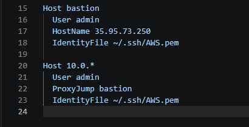
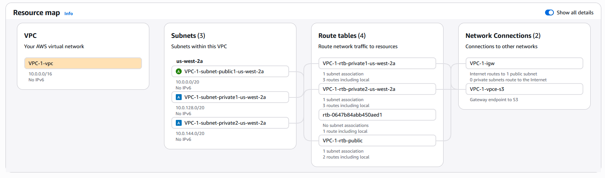
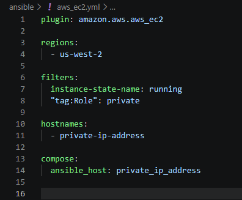

# AWS Private Infrastructure Automation with Ansible

## Overview

This project builds a scalable AWS environment using a bastion host, NAT instance, and Ansible dynamic inventory to manage private EC2 instances without static IPs or manual inventory.

## Key Features

- Bastion host for secure SSH access to private instances
- NAT instance for outbound internet access
- Ansible dynamic inventory (no static IP management)
- Tag-based filtering (`Role=private`)
- SSH ProxyJump for seamless access
- Idempotent Ansible playbooks

## Architecture

This diagram shows how Ansible connects to private EC2 instances through a bastion host, while private instances use a NAT instance for outbound internet access. The alternative was to use the  built in AWS function of a NAT gateway, but that was not cost effective for the purposes of this project.

## Problems Solved

### 1. Manual IP Management Did Not Scale

Initially, private instance IPs were manually added into SSH configs and inventory files. This approach does not scale and becomes difficult to maintain as the number of instances grows.This project replaces static inventory with Ansible dynamic inventory, allowing AWS to act as the source of truth. My thought process for this revolved around the question of having to automate processes for 100 devices, or 1000. Surely the answer is NOT to manually input the IPs into the inventory file.

### 2. Bastion Proxy Was Not Being Used

SSH connections to private instances were initially failing because traffic was attempting to connect directly instead of routing through the bastion host. The root cause was that SSH configuration only matched named hosts, while Ansible uses raw private IP addresses. This was resolved by updating the SSH configuration to match the private subnet range and automatically apply ProxyJump.

### 3. CIDR Overlap Caused Conflicts

A private AWS instance (10.200.50.100) was assigned the same IP address as the Ansible control node in the local environment. This caused incorrect routing and connection failures. The issue was resolved by rebuilding the AWS VPC using a non-overlapping CIDR range (10.0.0.0/16) and allowing AWS to automatically assign private IP addresses.

*Figure: Rebuilt VPC using non-overlapping CIDR range (10.0.0.0/16)*

### 4. Dynamic Inventory Needed Filtering

By default, Ansible dynamic inventory included all running EC2 instances, including the bastion and NAT instances. This was not desired, as only private workload instances should be managed. This was resolved by applying AWS instance tags and filtering on those tags in the inventory configuration.

*Figure: Ansible inventory file used to pull private IPs from AWS automatically*

Work in progress...