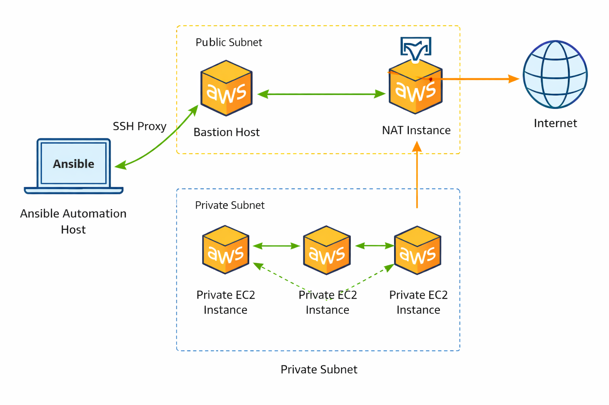

# AWS Private Infrastructure Automation with Ansible

## Overview

This project builds a scalable AWS environment using a bastion host, NAT instance, and Ansible dynamic inventory to manage private EC2 instances without static IPs or manual inventory.

## Key Features

- Bastion host for secure SSH access to private instances
- NAT instance for outbound internet access
- Ansible dynamic inventory (no static IP management)
- Tag-based filtering (`Role=private`)
- SSH ProxyJump for seamless access
- Idempotent Ansible playbooks

## Architecture

This diagram shows how Ansible connects to private EC2 instances through a bastion host, while private instances use a NAT instance for outbound internet access.

Work in progress...