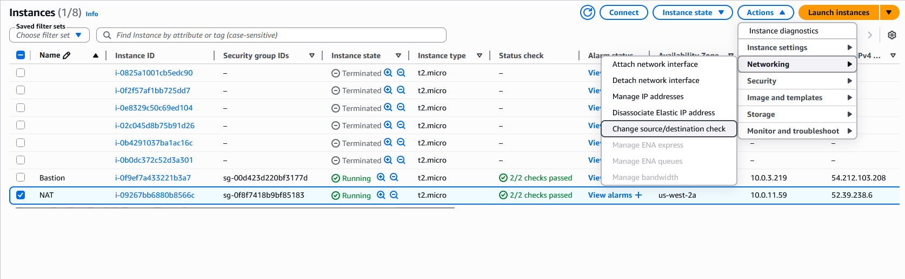
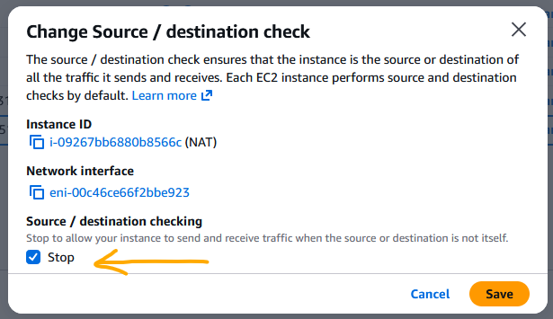

# NAT Configuration

## Overview

This section describes how the NAT instance was configured to provide outbound internet access for private EC2 instances.

## NAT Instance Setup

- Deployed in the public subnet
- Assigned a public IP address
- Enabled IP forwarding on the instance
- Configured iptables for NAT (MASQUERADE)

The code used to configure NAT is as follows: 

```bash
echo 'net.ipv4.ip_forward=1' | sudo tee /etc/sysctl.d/99-nat.conf
sudo sysctl --system
sudo iptables -t nat -A POSTROUTING -o enX0 -j MASQUERADE
sudo iptables -A FORWARD -i enX0 -o enX0 -m state --state RELATED,ESTABLISHED -j ACCEPT
sudo iptables -A FORWARD -i enX0 -o enX0 -j ACCEPT
sudo apt update
sudo apt install -y iptables-persistent
sudo netfilter-persistent save
```

To save time you could also copy/paste that code and turn it into an executable bash script:


## Why NAT Was Required

Private EC2 instances do not have public IP addresses and cannot reach the internet directly.

The NAT instance allows these private instances to:
- Download packages
- Install updates
- Access external services

while still remaining inaccessible from the public internet.

## Disable Source/Destination Check

By default, EC2 instances perform source/destination checks and only allow traffic that is addressed to them. Since the NAT instance must forward traffic on behalf of other instances, this check must be disabled. This was done by modifying the instance setting:

- Disable **Source/Destination Check** on the NAT instance

Without this change, traffic from private subnets would not be routed through the NAT instance.





*Figure: Disabling source/destination check on the NAT instance to allow packet forwarding.*