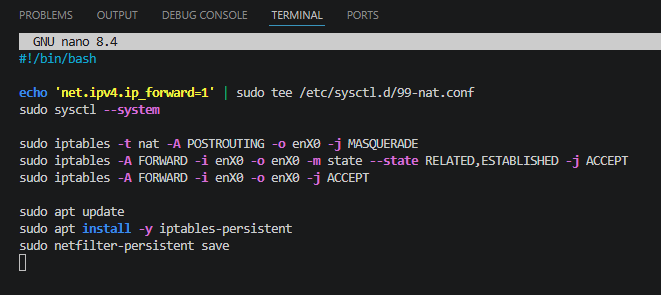

# NAT Configuration

## Overview

This section describes how the NAT instance was configured to provide outbound internet access for private EC2 instances.

## NAT Instance Setup

- Deployed in the public subnet
- Assigned a public IP address
- Enabled IP forwarding on the instance
- Configured iptables for NAT (MASQUERADE)

The code used to configure NAT is as follows: 

**echo 'net.ipv4.ip_forward=1' | sudo tee /etc/sysctl.d/99-nat.conf**

**sudo sysctl --system**

**sudo iptables -t nat -A POSTROUTING -o enX0 -j MASQUERADE**

**sudo iptables -A FORWARD -i enX0 -o enX0 -m state --state RELATED,ESTABLISHED -j ACCEPT**

**sudo iptables -A FORWARD -i enX0 -o enX0 -j ACCEPT**

**sudo apt update**

**sudo apt install -y iptables-persistent**

**sudo netfilter-persistent save**

To save time you could also copy/paste that code and turn it into an executable bash script:

