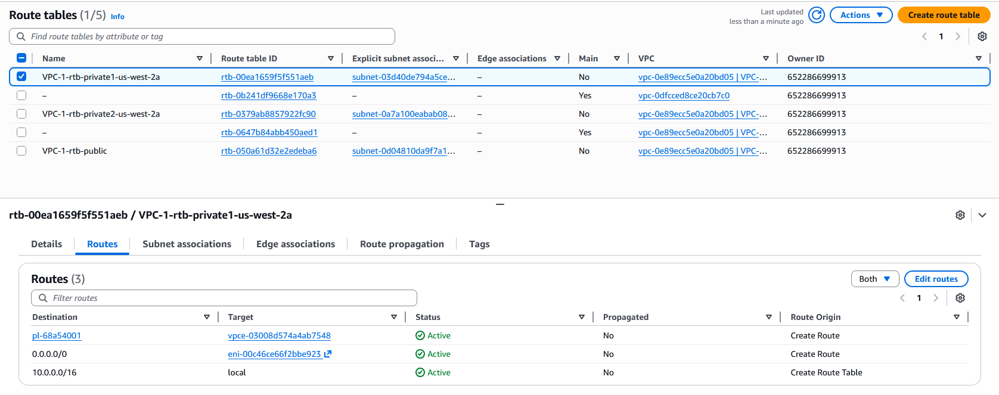
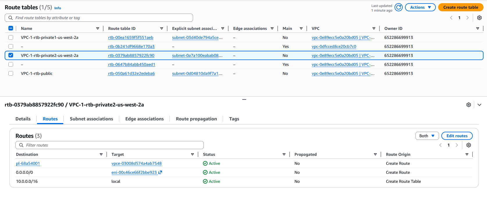

# Routing Configuration

## Overview

This section describes how route tables were configured so both private subnets could send outbound traffic through the NAT instance while remaining inaccessible from the public internet.

## Route Tables

- Public route table
  - 0.0.0.0/0 → Internet Gateway (IGW)

- Private route table
  - 0.0.0.0/0 → NAT instance (**eni-00c46ce66f2bbe923**)

## Route Table Screenshots  

*Figure: Table for Private Subnet 1*

*Figure: Table for Private Subnet 2*

## Subnet Associations

The public subnet was associated with the public route table. Both private subnets were associated with the private route table so outbound traffic could be forwarded to the NAT instance. This routing design allowed private instances to reach the internet for package installation and updates without exposing them directly to inbound public traffic. It also allowed both private subnets to share the same outbound path through the NAT instance.
